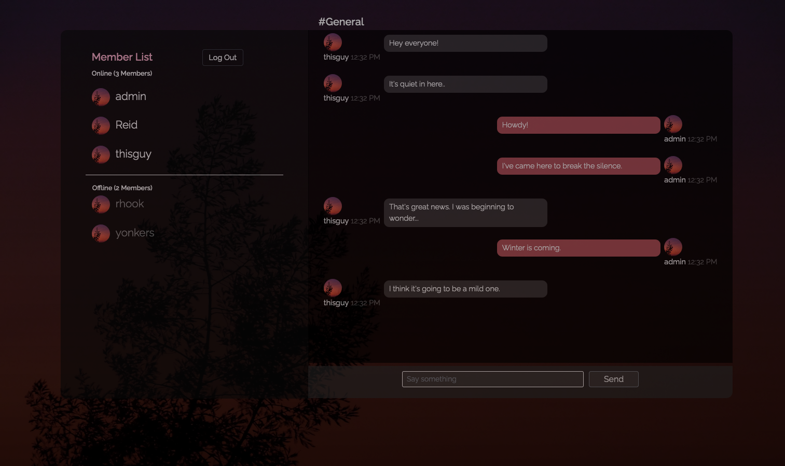

# NodeJS Chat Application

Simple full-stack chat application built with React, NodeJS and Express. It utilizes a postgresql database for data manipulation.

## Summary

After building a chat application with .NETCore and React, I wanted to get a better grasp at using JavaScript and NodeJS to handle the back-end lifting as opposed to a C# based framework. 

In this app, I added websockets for faster data and DOM manipulation and JSON Web Tokens to beef up my user authentication. As is important with any sensitive data stored in a database, I used the node package bcyrpt to create hashed version of user passwords that are stored in the database. For database queries, I used SQL to store and send message and user data. All api calls are handled by the promise based http client Axios. This application using asynchronous funtions. 

See my deployed version on Heroku - [Node Chat](https://reidnodechat.herokuapp.com)

## Installation Instructions

### Requirements

- [PostgreSQL](https://www.postgresql.org/download/)
- [pgAdmin](https://www.pgadmin.org/)
- [NodeJS](https://nodejs.org/en/download/)

1.) Clone the master repository onto your local machine.
2.) Create a new server in pgAdmin. 
3.) Copy and paste the contents of the db backup file located in project directory `/DbBackup/2020-23-12` into the pgAdmin Table Query Tool. 
4.) 

## Tech Stack Used
---
* Back-End
    * NodeJS
    * Express
    * SQL
    * PostgreSQL
    * JSON Web Token Authentication
* Front-End
    * React.js
    * Axios
    * Bootstrap
    * Flex-Box

## Author 

* **Reid Muchow** - *Full-Stack Web Developer* - [Website](https://www.reidmuchow.com) | [LinkedIn](https://www.linkedin.com/in/reidmuchow/)